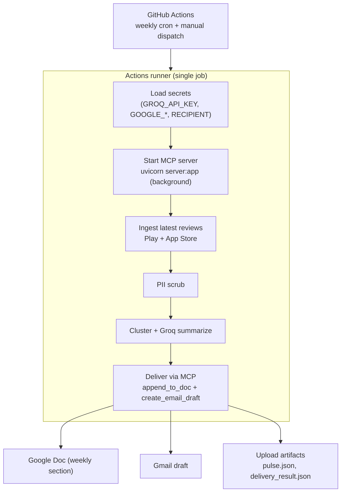
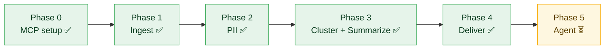

# Phase-wise Implementation Plan

How we build the **Weekly Review Pulse** agent incrementally. Each phase is independently testable and has a dedicated evaluation file with testing and exit criteria. This document describes **what each phase actually does** — the work and the reasoning — not the code.

> Companion docs: [`architecture.md`](./architecture.md), [`ProblemStatement.md`](./ProblemStatement.md), [`decisions.md`](./decisions.md).
> Per-phase exit criteria live in [`phases/`](./phases/).
>
> **Architecture note:** This is a **batch summarization** pipeline over a bounded weekly corpus — *not* RAG. Embeddings are used **in-memory for theme clustering only**; there is **no vector DB and no retrieval/Q&A layer** (see [ADR-007](./decisions.md)).

## Overview

| Phase | Name | Outcome | Status | Eval |
|-------|------|---------|--------|------|
| 0 | Foundations & MCP setup | Repo, env, MCP servers reachable | ✅ Done | [`phases/phase-0-foundations/eval.md`](./phases/phase-0-foundations/eval.md) |
| 1 | Review ingestion & normalization | Clean, normalized `Review[]` | ✅ Done | [`phases/phase-1-ingestion/eval.md`](./phases/phase-1-ingestion/eval.md) |
| 2 | PII scrubbing | PII-free review text | ✅ Done | [`phases/phase-2-pii/eval.md`](./phases/phase-2-pii/eval.md) |
| 3 | Theme clustering & summarization | `Pulse` (themes, quotes, actions) via Groq | ✅ Done | [`phases/phase-3-summarization/eval.md`](./phases/phase-3-summarization/eval.md) · [data analysis](./phases/phase-3-summarization/data-analysis.md) |
| 4 | Delivery via MCP | Google Doc + Gmail draft | ✅ Done (live delivery verified) | [`phases/phase-4-delivery/eval.md`](./phases/phase-4-delivery/eval.md) |
| 5 | Weekly scheduler & end-to-end agent | Automated weekly run on **GitHub Actions** (fetch → scrub → cluster → summarize → deliver) | ✅ Verified locally; CI pending secrets | [`phases/phase-5-orchestration/eval.md`](./phases/phase-5-orchestration/eval.md) |

Each phase produces a concrete artifact that the next phase consumes. The data contracts (`Review[]` → clean `Review[]` → `ThemedCorpus` → `Pulse` → delivered artifacts) are defined in [`architecture.md` §4](./architecture.md#4-data-models).

---

## Progress snapshot (Phases 0–4 complete)

The pipeline currently runs end-to-end **as separate phase commands** (Phase 5 will wire them into one). Real numbers from the latest run on the Groww corpus:

| Phase | What ran | Concrete result |
|-------|----------|-----------------|
| 1 · Ingest | Fetched public reviews via `google-play-scraper` (Play) + Apple RSS (App Store); filtered to ≥6 words, no emojis, English only | **20,700** reviews kept (Play 20,000 · App Store 700) from 200,993 parsed rows |
| 2 · Scrub | Deterministic regex/denylist PII gate over all 20,700 reviews | **929 redactions** across **807** fields (account_id 839, phone 51, handle 22, ambiguous 17); PII gate passed |
| 3 · Cluster + Summarize | Local `all-MiniLM-L6-v2` embeddings → KMeans `k=5` → top-3 by volume×severity → **1** Groq call (`llama-3.3-70b-versatile`) | `Pulse` at **189 words**, **1** Groq call, **~2,861** tokens. Themes: **Customer Support Issues**, **Technical Issues**, **Fees and Charges** |
| 4 · Deliver | Rendered pulse → local FastAPI MCP server (`http://127.0.0.1:8000`) `append_to_doc` + `create_email_draft` | Google Doc appended ([doc](https://docs.google.com/document/d/1oD3DfG9CzgAgPsqE6ulaedzi7zVIYcvs8b1FEb2f31w/edit)) + Gmail draft created (`draft_id r-8405432779978079885`); final PII scan passed |

**Currently running services (local):**

| Service | Purpose | URL |
|---------|---------|-----|
| Phase 3 pulse dashboard | Themes / clusters / analytics / recommendations UI | `http://127.0.0.1:8765` |
| FastAPI MCP server (`server.py`) | REST tools used by Phase 4 automation | `http://127.0.0.1:8000` |
| Streamlit MCP UI (`app.py`) | Manual Google Docs / Gmail tool UI | `http://127.0.0.1:8501` |

> **MCP server note:** the [ArpitDumka/Google-mcp-server](https://github.com/ArpitDumka/Google-mcp-server) repo ships a Streamlit UI (`app.py`) for manual use and a **Streamlit Cloud** deployment. Automated Phase 4 delivery needs a **REST API**, so a FastAPI entrypoint (`server.py`, exposing `/append_to_doc`, `/create_email_draft`, `/health`) was added and is run locally with `uvicorn server:app`. Streamlit Cloud cannot host the REST API — a public deployment would use Render / Railway / Cloud Run.

---

## Phase 0 — Foundations & MCP setup

**Goal:** Stand up the skeleton and *prove* we can reach the Google Docs and Gmail MCP servers before building anything that depends on them.

**What actually happens**
- We lay down the project structure and a single config surface (window length, theme cap, recipient alias, dry-run flag) so nothing important is hard-coded.
- We connect to the **Google Docs** and **Gmail** MCP servers/connectors the environment provides and confirm authentication is handled by the server (not by us writing OAuth code).
- We **discover** what each server can do: list its tools and read the input schema of the specific tools we'll need (create/update a document, create a draft). This tells us exactly what fields each tool expects.
- We set up logging and a placeholder "run summary" so every later phase has a consistent place to report what it did.

**Inputs:** environment with MCP servers/connectors configured.
**Outputs:** a runnable skeleton + a "hello MCP" check that lists tools and prints their schemas.

**Key considerations**
- This phase exists to **de-risk the integration early** — discovering a missing tool or permission now is far cheaper than in Phase 4.
- We commit to MCP-first here ([ADR-001](./decisions.md)); no direct Google API code is introduced.

**Risks & mitigations**
- *MCP server missing a needed capability* → discovered now via schema inspection, while there's time to adapt.
- *Auth/permission gaps* → surfaced by the connectivity check, not at delivery time.

**Deliverables:** project skeleton, MCP config, a tool-discovery check.
**Exit criteria:** see [`phases/phase-0-foundations/eval.md`](./phases/phase-0-foundations/eval.md).

**Status — ✅ Done.** Skeleton (`phase-0-mcp-setup/`) with `hello_mcp.py` discovery check and example MCP config in place; MCP-first commitment held (no direct Google SDK in the pulse pipeline).

---

## Phase 1 — Review ingestion & normalization

**Goal:** Turn messy, source-specific public exports into one clean, consistent list of `Review` records inside the reporting window.

**What actually happens**
- We take the **public review exports** for both stores (App Store + Play Store) — exports only, no scraping behind logins.
- We **parse** each source's format and **map it onto one common schema** so the rest of the pipeline never has to care which store a review came from.
- We **normalize** the fiddly bits: ratings forced to 1–5 integers, dates parsed to a single ISO format, empty titles tolerated.
- We **filter** down to the rolling 8–12 week window from config.
- We **dedupe** reviews that appear more than once (e.g., the same review re-appearing across exports/runs).
- We assign each review a **stable, identity-free ID** — a hash of its content — so dedup is reliable and no reviewer identity is introduced ([ADR-009](./decisions.md)). Reviewer names/handles are dropped at this step.

**Inputs:** raw exports.
**Outputs:** a normalized, de-duplicated `Review[]` for the window.

**Key considerations**
- This layer is **fully deterministic** ([ADR-003](./decisions.md)) so runs are reproducible and easy to test.
- Identity is removed **at parse time**, before PII scrubbing even runs — defense in depth.

**Risks & mitigations**
- *Malformed/empty rows* → skipped gracefully with a logged count, never crash the run.
- *Export format drift* → parsing is isolated per source so one store's change doesn't break the other.

**Deliverables:** ingestion module + a normalized dataset from a sample export.
**Exit criteria:** see [`phases/phase-1-ingestion/eval.md`](./phases/phase-1-ingestion/eval.md).

**Status — ✅ Done.** `phase-1-review-ingest/` fetches real reviews via **`google-play-scraper`** (Play Store, `com.nextbillion.groww`) and Apple's **customer-reviews RSS** feed (App Store, `1404871703`). From 200,993 parsed rows, filters (≥6 words, no emojis, English only, in-window, dedup, per-store cap) yielded **20,700** normalized reviews → `normalized_reviews.json` (Play 20,000 · App Store 700).

---

## Phase 2 — PII scrubbing

**Goal:** Guarantee that no personally identifiable information can reach the LLM or any artifact. This is the project's privacy boundary.

**What actually happens**
- Every review's text and title pass through a **deterministic scrubber** before anything else looks at them.
- We detect and mask/remove the obvious PII categories: **emails, phone numbers, handles/usernames, account/order/reference IDs, and device IDs**.
- Anything **ambiguous is redacted by default** — we deliberately prefer over-redacting to letting PII slip through ([ADR-002](./decisions.md)). Harmless lookalikes (e.g., an app version like `v8.2.1`) are protected so we don't gut the content.
- We **log redaction counts** so each run is auditable.
- Crucially, scrubbing is wired as a **hard gate**: the summarization stage simply cannot run on un-scrubbed text.

**Inputs:** normalized `Review[]` from Phase 1.
**Outputs:** clean `Review[]` with PII removed, plus a redaction report.

**Key considerations**
- Placing this *before* the LLM (not just on the final output) means PII never enters prompts, logs, or intermediate state.
- Recall (catching PII) is explicitly prioritized over precision (avoiding false redactions).

**Risks & mitigations**
- *Novel PII formats slip through* → ambiguous-token fail-safe redaction catches many; the artifact-level re-check in Phase 4 is a second net.
- *Over-redaction harms theming* → we measure content integrity in the eval so we keep reviews usable.

**Deliverables:** PII scrubber module + a redaction report on the sample dataset.
**Exit criteria:** see [`phases/phase-2-pii/eval.md`](./phases/phase-2-pii/eval.md).

**Status — ✅ Done.** `phase-2-pii-scrub/` scrubbed all 20,700 reviews → `scrubbed_reviews.json` with **929 redactions** across **807** fields (account_id 839, phone 51, handle 22, ambiguous 17). The gate module blocks summarization on un-scrubbed input.

---

## Phase 3 — Theme clustering & summarization

**Goal:** Discover what users are actually talking about and distill it into the one-page `Pulse`: top 3 themes, 3 real quotes, 3 action ideas, ≤ 250 words.

> **Data-driven design:** See [`phases/phase-3-summarization/data-analysis.md`](./phases/phase-3-summarization/data-analysis.md) for corpus stats (20,700 scrubbed reviews) and the recommended clustering → Groq strategy.

**What actually happens**
- **Clustering (deterministic, in-memory):**
  - We **embed** each clean review locally (`sentence-transformers/all-MiniLM-L6-v2`) and **cluster** with KMeans (`k ≤ 5`, fixed seed) so themes *emerge from the data* ([ADR-008](./decisions.md)).
  - On the current corpus, expect clusters around **trading/F&O**, **customer support**, **app stability**, **charges/fees**, and **payments/UPI** — keyword analysis on 1–2★ reviews shows trading (~34%) and support (~26%) as the largest pain buckets.
  - We **rank** clusters by `volume × (1 + severity)` where severity = share of 1–2★ reviews in the cluster.
  - For each top theme, we gather **12 representative reviews** (nearest centroid), **truncated to 350 chars** in the Groq prompt — enough for verbatim quotes while staying within token limits (see Groq budget below).
  - All of this happens **in memory** — embeddings are discarded after the run; there is no vector DB ([ADR-007](./decisions.md)).
- **Summarization (Groq LLM — rate-limited):**
  - **Provider:** Groq (`groq` SDK). Model: `llama-3.3-70b-versatile` (`GROQ_MODEL`).
  - **Free-tier limits:** 30 RPM · 1K RPD · 12K TPM · 100K TPD — Phase 3 is designed so a **single weekly run uses ≤2 requests and ~2–3K tokens** (see [`architecture.md` §3.4.1](./architecture.md#341-groq-rate-limit-budget-llama-33-70b-versatile)).
  - **Call pattern:**
    1. **Primary call (required):** compact prompt with top-3 cluster stats + 12 reps/theme (truncated to 350 chars) → structured `Pulse` JSON (**36 snippets max** in one call).
    2. **Repair call (optional, max 1):** only if JSON/schema is invalid — not for quote or word-count fixes.
  - **Deterministic fixes (0 Groq calls):** invalid quote → swap to next rep from the same cluster; over-length note → trim in code.
  - Groq **labels** themes, **selects 3 quotes by `review.id`** from the provided list ([ADR-004](./decisions.md)), and **drafts 3 action ideas**.
  - Pre-flight **token estimate**; if over `GROQ_MAX_TOKENS_PER_RUN` (default 8000), reduce reps before calling.
  - `DRY_RUN=true` → skip all Groq calls; emit `ThemedCorpus` + placeholder `Pulse` for testing.

**Inputs:** clean `Review[]` from Phase 2 (currently ~20,700 reviews; Play-heavy).
**Outputs:** a validated `Pulse` object ([schema](./architecture.md#4-data-models)).

**Key considerations**
- The split is deliberate: **clustering is deterministic** (reproducible grouping), **Groq only does language work** (labels, quotes, actions). This keeps the creative step contained and auditable ([ADR-003](./decisions.md)).
- Quotes are traceable back to a source review ID, which is what makes "no fabrication" checkable.
- Corpus is short-text (avg ~23 words/review) and polarized (42% 1–2★, 52% 4–5★) — severity-weighted ranking prevents the pulse from being dominated by generic 5★ praise.

**Risks & mitigations**
- *LLM invents or paraphrases a quote* → quote fidelity substring check; deterministic rep swap on failure (no extra Groq call).
- *Clusters are noisy/overlapping* → k=5 cap + severity ranking; Groq labels disambiguate similar clusters.
- *Groq rate limits (12K TPM / 100K TPD)* → ≤2 calls/run, ~2–3K tokens/run, 12 reps/theme, 350-char truncation, sequential calls only, pre-flight token estimate.
- *Play Store dominates (96%)* → record source split in `Pulse.meta`; don't over-generalize to App Store.

**Deliverables:** clustering + Groq summarization module producing a validated `Pulse`.
**Exit criteria:** see [`phases/phase-3-summarization/eval.md`](./phases/phase-3-summarization/eval.md).

**Status — ✅ Done.** `phase-3-theme-summarize/` embedded all 20,700 reviews (`all-MiniLM-L6-v2`), clustered with KMeans `k=5`, and ranked top 3 by volume×severity (clusters of 6,527 / 3,697 / 3,303 reviews). A **single** Groq call (`llama-3.3-70b-versatile`, **~2,861** tokens, well under the 8,000 budget) produced a validated **189-word** `Pulse` with themes **Customer Support Issues · Technical Issues · Fees and Charges**, 3 verbatim quotes, and 3 action ideas → `pulse.json` / `pulse_dashboard.json`. A local dashboard (`scripts/serve_pulse.py`, port 8765) renders themes, clusters, analytics, and recommendations.

---

## Phase 4 — Delivery via MCP

**Goal:** Put the pulse where stakeholders read it (a Google Doc) and stage an email they can send (a Gmail draft) — via your **Google MCP HTTP tool server** ([ArpitDumka/Google-mcp-server](https://github.com/ArpitDumka/Google-mcp-server)).

**What actually happens**
- We **render the `Pulse`** into a document body (week title, 3 themes, quotes, actions) and an email subject/body.
- We call the MCP server's **`append_to_doc`** tool (`doc_id` + `content`) — same contract as [`docs_tool.py`](https://github.com/ArpitDumka/Google-mcp-server/blob/main/docs_tool.py).
- We call **`create_email_draft`** (`to`, `subject`, `body`) — draft only, never auto-sent ([ADR-005](./decisions.md)).
- Tool calls go to the **HTTP API** (`POST /append_to_doc`, `POST /create_email_draft`) exposed by `uvicorn server:app` — not direct Google SDK usage in this repo.
- **Idempotent retries:** `delivery_state.json` records `week_of` → doc URL + draft ID so a re-run skips duplicates.
- Final **PII scan** on rendered text before send.

**MCP server setup (your deployment)**
| Surface | URL / command | Use |
|---------|----------------|-----|
| Streamlit UI | [app-mcp-server Streamlit](https://app-mcp-server-cjjwz9p53fzpo7axcwexav.streamlit.app/) | Manual testing only |
| FastAPI tools | `uvicorn server:app --reload` → `http://127.0.0.1:8000` | **Phase 4 automated delivery** |
| Env on server | `GOOGLE_CREDENTIALS_JSON`, `GOOGLE_TOKEN_JSON` | OAuth for Docs + Gmail APIs |

**Phase 4 config** (`phase-4-mcp-deliver/.env`): `MCP_SERVER_BASE_URL`, `GOOGLE_DOC_ID`, `RECIPIENT`, `DRY_RUN`.

**Inputs:** validated `Pulse` from Phase 3 (`pulse_dashboard.json`).
**Outputs:** Google Doc URL + Gmail draft ID (+ `data/output/delivery_result.json`).

**Deliverables:** `phase-4-mcp-deliver/` — render, HTTP MCP client, `scripts/run_phase4.py`.
**Exit criteria:** see [`phases/phase-4-delivery/eval.md`](./phases/phase-4-delivery/eval.md).

**Status — ✅ Done (live delivery verified).** `phase-4-mcp-deliver/` renders the `Pulse`, discovers tools via `/openapi.json`, and calls `append_to_doc` + `create_email_draft` on the local FastAPI MCP server. A live run appended to Google Doc `1oD3DfG9CzgAgPsqE6ulaedzi7zVIYcvs8b1FEb2f31w` and created Gmail draft `r-8405432779978079885` (`delivery_result.json`), with the final PII scan passing. Prerequisites learned along the way: a FastAPI `server.py` had to be added to the MCP repo (the Streamlit app can't serve REST), `MCP_SERVER_BASE_URL` must point at `http://127.0.0.1:8000` (not the Streamlit URL), and `GOOGLE_DOC_ID` must be a real Doc ID with edit access.

---

## Phase 5 — Weekly scheduler & end-to-end agent (GitHub Actions)

**Goal:** Turn the proven phase commands into a single, **unattended weekly job** that fetches the *latest* reviews and produces a fresh pulse — scheduled on **GitHub Actions** so no one has to trigger it by hand.

**What actually happens**
- A **GitHub Actions workflow** (`.github/workflows/weekly-pulse.yml`) runs on a **weekly `cron` schedule** (plus a manual `workflow_dispatch` trigger for on-demand runs).
- The job runs the full sequence, each stage feeding the next — **exactly the existing Phase 1–4 logic**, no re-implementation:
  1. **Ingest (fresh) + accumulate:** re-fetch the latest reviews from Play (`google-play-scraper`) and App Store (Apple RSS), normalize/filter/dedup, then **merge into a persistent, deduped `corpus.json`** (baseline **20,700**). Review ids are content hashes, so re-fetched reviews dedup and only genuinely new ones grow the total — the corpus **accumulates** week over week (`added_this_week`, `corpus_total`, `weeks_accumulated` are recorded).
  2. **Scrub:** run the PII gate over the **whole accumulated corpus**.
  3. **Cluster + Summarize:** embed + KMeans + top-3 ranking → **one** Groq call → validated `Pulse`, **recomputed over the full corpus** (themes, quotas, quotes, and action ideas all reflect the growing history).
  4. **Deliver via MCP:** render the pulse and call `append_to_doc` + `create_email_draft` on the MCP server.
  5. **Dashboard:** the local dashboard on port 8765 (`serve_pulse.py`) is **live-reload** and reflects the new `pulse.json` automatically.
- Between stages it **validates the hand-off** against the data contract and **fails loudly** rather than producing a half-finished result; **PII scrubbing always runs before summarization**.
- It emits a **run summary** (reviews ingested/kept, themes, top 3, doc URL, draft ID) to the Actions log and uploads the run artifacts (`pulse.json`, `delivery_result.json`) as workflow artifacts.

**MCP server reachability (the key CI constraint)**
A GitHub Actions runner **cannot reach `http://127.0.0.1:8000` on a developer laptop** — the local server only exists on that machine. We use **Option A: run the MCP server inside the runner.** The workflow checks out the [MCP server repo](https://github.com/ArpitDumka/Google-mcp-server), overlays our FastAPI entrypoint (`phase-5-orchestration/ci/server.py`), starts `uvicorn server:app` as a **background step in the same job**, and points `MCP_SERVER_BASE_URL` at `http://127.0.0.1:8000` *within that runner*. Google OAuth is injected from **GitHub Secrets** and the deployed (non-interactive) auth path refreshes the token in place. This needs **no separately hosted service** and keeps the credential-bearing endpoint alive only for the ~2 minutes a run takes.

> *Alternative (not used):* deploy `server.py` to Render / Railway / Cloud Run and point `MCP_SERVER_BASE_URL` at that public URL. Only worth it if the Streamlit UI must also be public or runs become frequent/on-demand. Switching later changes only `MCP_SERVER_BASE_URL` — no pipeline code changes.

**Secrets & config (GitHub → repo → Settings → Secrets and variables → Actions):**

| Secret | Used by | Notes |
|--------|---------|-------|
| `GROQ_API_KEY` | Phase 3 | Groq summarization |
| `GOOGLE_DOC_ID` | Phase 4 | Target weekly doc (append mode) |
| `RECIPIENT` | Phase 4 | Gmail draft recipient |
| `GOOGLE_TOKEN_JSON` | MCP server | OAuth token (with refresh token) injected into the runner |
| `GOOGLE_CREDENTIALS_JSON` | MCP server | OAuth client secrets (fallback) |

> `MCP_SERVER_BASE_URL` is set to `http://127.0.0.1:8000` by the workflow, so it is not a secret. Full setup steps (including how to generate `token.json`) live in [`phase-5-orchestration/README.md`](../phase-5-orchestration/README.md).

**Inputs:** the `cron` trigger + repo secrets (no manual export needed — data is fetched fresh each run).
**Outputs:** a weekly Google Doc update + Gmail draft + a run summary and uploaded artifacts, with **zero manual steps**.

**Key considerations**
- This phase is where the **phase-gated discipline** ([ADR-006](./decisions.md)) becomes a single dependable, *scheduled* workflow.
- **Idempotency across weeks:** `delivery_state.json` keys on `week_of`; because it is ephemeral on a fresh runner, the doc is used in **append mode** so a re-run for the same week adds a clearly timestamped section rather than corrupting prior content.
- A `DRY_RUN=true` path lets a workflow run exercise the whole pipeline (through `Pulse`) **without writing to Google** — useful for testing the schedule and for PRs.
- Runner cost/time: embedding 20k reviews on a CPU runner is the slowest step; the schedule is weekly so this is acceptable (cache the model download to speed it up).

**Risks & mitigations**
- *Runner can't reach a laptop-local MCP server* → the server runs **inside** the runner and is called over loopback.
- *OAuth token expiry in CI* → store a long-lived refresh token (Google OAuth app in **Production**, not *Testing*); fail loudly (and skip delivery) if auth fails, keeping the generated `Pulse` as an artifact.
- *Store fetch throttling/format drift* → per-source parsers isolated; a fetch failure for one store doesn't block the other; counts logged.
- *Silent partial success* → explicit inter-stage validation + loud failures + uploaded artifacts for post-mortem.

**Deliverables:** `.github/workflows/weekly-pulse.yml` (scheduled + manual), the orchestrator `phase-5-orchestration/scripts/run_weekly_pulse.py` (calls Phases 1→4 in order, one venv per phase), the CI FastAPI overlay `phase-5-orchestration/ci/server.py`, and setup docs in `phase-5-orchestration/README.md`.
**Exit criteria:** see [`phases/phase-5-orchestration/eval.md`](./phases/phase-5-orchestration/eval.md).

**Status — ✅ Verified locally end-to-end; CI pending secrets.** The orchestrator ran the full chain locally — fetch (fresh Play + App Store reviews) → scrub → cluster → Groq summarize → MCP delivery — producing a Google Doc update and a Gmail draft. Two fixes were made while running it: (1) Phase 3's deterministic word-count trim now **truncates verbatim quotes to a marked prefix** so the 250-word budget is always met (previously long quotes made Phase 4 reject the pulse); (2) a stale Google OAuth token (`invalid_grant: expired or revoked`) was regenerated — the documented reason the OAuth app must be in **Production**. Remaining to go green in CI: initialize a Git repo, push to GitHub, add the secrets above, and trigger a manual `workflow_dispatch` run.

**Scheduled run (as designed):**

---

## Sequencing & dependencies

Each phase should pass its `eval.md` before the next begins. Phase 4 depends on Phase 0's MCP connectivity being verified; Phase 3 depends on Phase 2's scrubbed output; Phase 5 simply wires the proven stages together.
