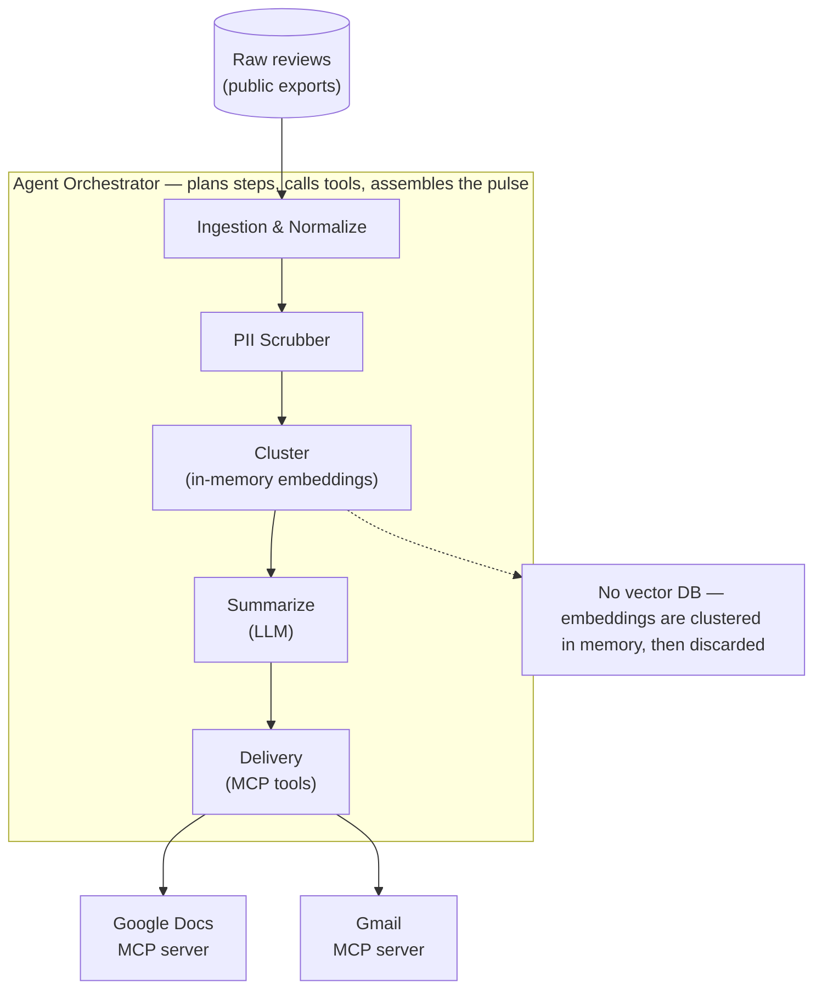
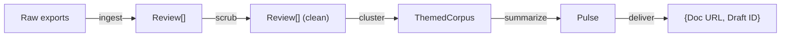
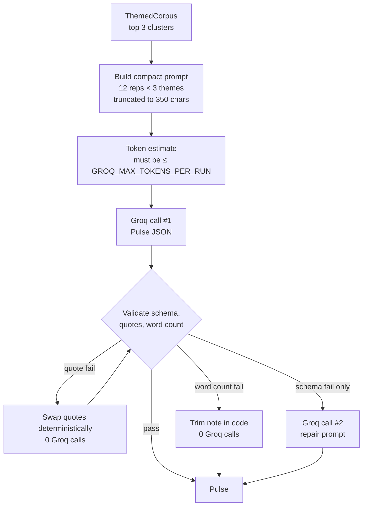
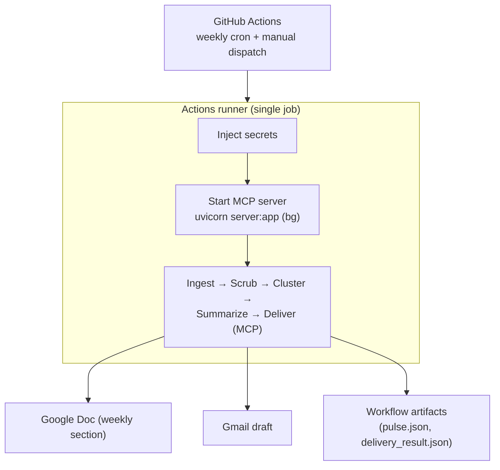
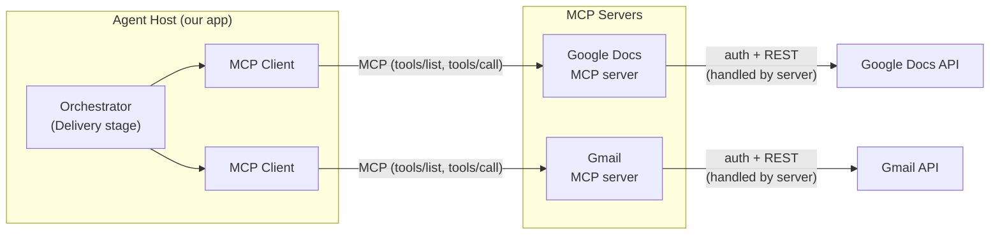
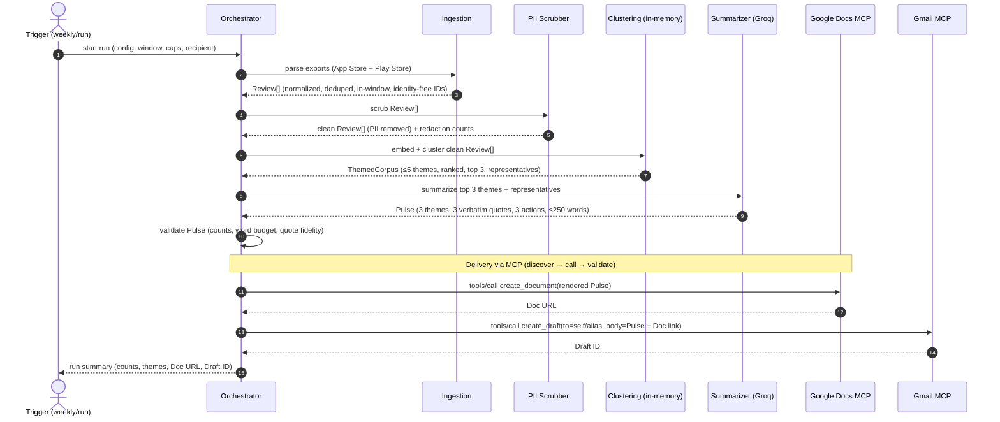

# Architecture

This document describes the architecture of the **Weekly Review Pulse** agent: an AI pipeline that turns recent App Store + Play Store reviews for **Groww** into a one-page weekly note, writes it to **Google Docs**, and drafts an email in **Gmail** — all via **MCP servers**.

> Read alongside [`ProblemStatement.md`](./ProblemStatement.md), [`ImplementationPlan.md`](./ImplementationPlan.md), and [`decisions.md`](./decisions.md).

## 0. Build status (what is done so far)

Phases 0–4 are implemented and have run against the real Groww corpus; Phase 5 (single-command orchestration) is not started. The stages currently run as separate phase commands and hand off via JSON artifacts on disk.

| Stage | Component | Status | Evidence from the latest run |
|-------|-----------|--------|------------------------------|
| Ingestion | `phase-1-review-ingest/` | ✅ Done | **20,700** reviews (Play 20,000 · App Store 700) from 200,993 parsed rows; `google-play-scraper` + Apple RSS |
| PII scrub | `phase-2-pii-scrub/` | ✅ Done | **929 redactions** / **807 fields** (account_id 839, phone 51, handle 22, ambiguous 17) |
| Cluster + Summarize | `phase-3-theme-summarize/` | ✅ Done | KMeans `k=5`; **1** Groq call, **~2,861** tokens; 189-word `Pulse` — *Customer Support Issues · Technical Issues · Fees and Charges* |
| Delivery | `phase-4-mcp-deliver/` | ✅ Done (live) | Google Doc appended + Gmail draft `r-8405432779978079885`; PII re-scan passed |
| Weekly scheduler | Phase 5 (GitHub Actions) | ✅ Verified locally; CI pending secrets | Orchestrator ran the full chain locally (fresh fetch → deliver); weekly `cron` workflow ready — see [§3.6](#36-agent-orchestrator--weekly-scheduler-github-actions) |

**MCP server reality:** the [Google MCP server repo](https://github.com/ArpitDumka/Google-mcp-server) ships a Streamlit UI (`app.py`, also deployed to Streamlit Cloud) for manual use. Automated delivery needs a REST API, so a FastAPI entrypoint (`server.py`) was added exposing `POST /append_to_doc`, `POST /create_email_draft`, and `GET /health`, run locally via `uvicorn server:app` on `http://127.0.0.1:8000`. Streamlit Cloud cannot host the REST API; a public deployment would target Render / Railway / Cloud Run. Locally running now: pulse dashboard (`:8765`), FastAPI MCP server (`:8000`), Streamlit UI (`:8501`).

## 1. Design goals

- **MCP-first integrations** — Google Docs and Gmail are reached through MCP servers, never bespoke OAuth/REST clients.
- **Batch, not RAG** — this is a once-a-week summarization over a bounded corpus. We process *all* in-window reviews each run. **No vector database and no retrieval/Q&A layer** — embeddings are used only **in-memory** to cluster reviews into themes. See [ADR-007](./decisions.md).
- **Deterministic where possible, LLM where needed** — ingestion, normalization, dedup, date-filtering, and PII stripping are deterministic; theme labeling, quote selection, and action ideas use **Groq**. See [ADR-003](./decisions.md).
- **Privacy by construction** — PII is stripped before any text reaches the LLM or an artifact; record IDs are identity-free content hashes. See [ADR-002](./decisions.md), [ADR-009](./decisions.md).
- **Reproducible** — the same review export produces a stable, auditable pulse.
- **Composable & contract-driven** — each stage consumes and produces a well-defined object (`Review[]`, `ThemedCorpus`, `Pulse`) and is independently testable (see per-phase `eval.md`).

## 2. High-level overview



**Stage contracts (what flows between stages):**



## 3. Components

### 3.1 Ingestion & Normalization
- **Input:** public reviews (App Store + Play Store). Public data only — no scraping behind store logins (per [`ProblemStatement.md`](./ProblemStatement.md)).
- **As built:** Play Store reviews are fetched with the **`google-play-scraper`** library (`reviews_all`, `com.nextbillion.groww`); App Store reviews via Apple's public **customer-reviews RSS** feed (`itunes.apple.com/.../rss/customerreviews`, app `1404871703`). The RSS feed is page-capped, which is why the App Store yield (~700) is far smaller than Play (~20k). Filters applied: **≥6 words, no emojis, English only**, in-window, dedup, per-store cap.
- **Responsibilities:**
  - **Parse** each source's export format into a common shape.
  - **Normalize** field names, rating scales (force 1–5 ints), and dates (to ISO).
  - **Filter** to the configured rolling window (default 8–12 weeks).
  - **Dedupe** repeated reviews (same content re-exported across runs/sources).
  - **Assign IDs** that are stable across runs and contain no reviewer identity (content hash; see [ADR-009](./decisions.md)).
- **Output:** a list of normalized `Review` records (schema below).

**Normalized `Review` schema:**

| Field | Type | Notes |
|-------|------|-------|
| `id` | string | Stable hash of `(source + normalized text + date)` — no reviewer identity |
| `source` | enum | `app_store` \| `play_store` |
| `rating` | int | 1–5 |
| `title` | string | May be empty |
| `text` | string | Review body |
| `date` | ISO date | Used for the 8–12 week window |
| `app_version` | string? | If present in export |
| `locale` | string? | If present in export |

> Reviewer name/handle and any account identifier are **dropped at parse time** — they never enter a `Review`.

### 3.2 PII Scrubber
- Runs **before** any LLM call or artifact write — the single privacy boundary ([ADR-002](./decisions.md)).
- Operates on the `text` and `title` fields of each `Review`.
- **Categories handled:**

| Category | Examples | Handling |
|----------|----------|----------|
| Emails | `a@b.com` | Mask/remove |
| Phone numbers | intl + local formats | Mask/remove |
| Handles / usernames | `@user`, "my id is …" | Mask/remove |
| Account / order / ref IDs | long digit/alphanumeric runs | Mask/remove |
| Device IDs | UUID-like strings | Mask/remove |

- **Strategy:** deterministic regex + denylist; ambiguous tokens **fail safe to redaction** (recall prioritized over precision). App version strings like `v8.2.1` are protected from the ID rule.
- **Guarantee:** no PII leaves this stage. Redaction counts are logged per run.

### 3.3 Theme Clustering (in-memory embeddings)
- **Embed:** each clean review is embedded with an embedding model, **in memory** — nothing is persisted to a vector DB ([ADR-007](./decisions.md)).
- **Cluster:** embeddings are grouped with an unsupervised clustering step to *discover* themes from the data rather than forcing a fixed taxonomy ([ADR-008](./decisions.md)). Examples that tend to emerge: onboarding, KYC, payments, statements, withdrawals.
- **Cap at 5:** the number of themes is constrained to **≤ 5** (e.g., choose `k ≤ 5`, or merge the smallest clusters / route outliers to an "other" bucket that is not surfaced).
- **Rank:** clusters are ranked by a blend of **volume** (how many reviews) and **severity** (e.g., skew toward low ratings) to choose the **top 3** for the note.
- **Select representatives:** for each top theme, pick candidate reviews closest to the cluster centroid as quote candidates for the summarizer.
- **Output:** a `ThemedCorpus` — clusters with labels-to-be, sizes, rating stats, and representative review references.

### 3.4 Summarization (Groq LLM)
- **Provider:** [Groq](https://groq.com/) via the official `groq` Python SDK — fast inference for structured summarization.
- **Model:** `llama-3.3-70b-versatile` (configurable via `GROQ_MODEL`).
- **Input:** the top clusters from the `ThemedCorpus` (top 3 themes + a **small, capped** representative set). The full scrubbed corpus (~20k reviews) is **never** sent to Groq; see [Phase 3 data analysis](./phases/phase-3-summarization/data-analysis.md).
- **Responsibilities (Groq — language only):**
  - **Label** each theme with a short human-readable name.
  - **Select 3 verbatim quotes** by referencing `review.id` values from the provided candidate list — **no invented wording** ([ADR-004](./decisions.md)).
  - **Draft 3 action ideas** that are concrete and traceable to the themes.
  - **Enforce length:** the note body stays **≤ 250 words** and scannable.
- **Responsibilities (code — deterministic):**
  - Clustering, ranking, representative selection, quote **fidelity validation** (substring check), and word-count trimming when possible **without** a second Groq call.
- **Output:** structured JSON → validated `Pulse` object ([§4 data model](#4-data-models)).

#### 3.4.1 Groq rate-limit budget (`llama-3.3-70b-versatile`)

Free-tier limits for this model:

| Limit | Quota | Weekly-run budget |
|-------|-------|-------------------|
| Requests / minute | 30 | **≤ 2 calls** (primary + optional repair) |
| Requests / day | 1,000 | **≤ 2 calls** (~0.2% of daily quota) |
| Tokens / minute | 12,000 | **≤ ~2,400 tokens** per run (single burst; headroom under 12K TPM) |
| Tokens / day | 100,000 | **≤ ~2,400 tokens** per run (~2.4% of daily quota) |

**Design principle:** one Groq call should succeed; anything else is handled in Python.



| Rule | Value | Why |
|------|-------|-----|
| Max Groq calls / run | **2** (1 primary + 1 schema repair) | Stays under RPM/RPD; repair is rare |
| Representatives / theme | **12** (max in config; shrink if over token budget) | Up to **36 snippets** in one primary call (3 themes × 12 reps) |
| Max chars / review in prompt | **350** | Longer context per rep while staying under TPM |
| Target tokens / run | **~2,000–2,500** (in + out) | Measured ~2,384 on current corpus; headroom under 12K TPM and 100K TPD |
| `GROQ_MAX_TOKENS_PER_RUN` | **8000** (default) | Pre-flight cap; `shrink_reps()` reduces reps if estimate exceeds budget |
| Clustering | **0 Groq calls** | Local `sentence-transformers` + scikit-learn |
| `DRY_RUN=true` | **0 Groq calls** | Build `ThemedCorpus` + mock `Pulse` locally |
| Quote repair | **Deterministic swap** to next valid rep | Avoids extra Groq call on fidelity failure |
| Word-count repair | **Deterministic trim** (shorten summaries/actions, then truncate quotes to a marked verbatim prefix `…`) | Avoids Groq for over-length notes; guarantees the ≤250-word budget even when quotes are long |
| Before each call | **Token estimate**; shrink reps if over budget | Never exceed `GROQ_MAX_TOKENS_PER_RUN` |

**Estimated token math (current corpus, avg ~23 words/review):**

| Component | Tokens (approx.) |
|-----------|------------------|
| System + instructions | ~800 |
| 3 × cluster stats | ~150 |
| 36 reps × ~45 tokens (truncated to 350 chars) | ~1,050 |
| Output `Pulse` JSON | ~400 |
| **Total per primary call** | **~2,400** |
| Primary + 1 repair (worst case) | **~4,800** |

At ~4,800 tokens worst-case, the **100K TPD** ceiling allows ~**20 full runs/day** — far more than one weekly pulse. The binding constraint is **burst TPM (12K)**, so all calls for a run are **sequential** (never parallel) and the prompt is **pre-truncated** before send.

**What we explicitly do not do:**
- Send all 20,700 reviews to Groq (~610k tokens — would exhaust daily quota in one call).
- One Groq call per cluster, per review, or per theme (would burn RPM/RPD).
- Parallel Groq requests in the same run (would spike TPM).
- More than **2** Groq calls per run, even on validation failure — fall back to deterministic `Pulse` assembly instead.

### 3.5 Delivery (MCP)

**Google MCP HTTP tool server** ([ArpitDumka/Google-mcp-server](https://github.com/ArpitDumka/Google-mcp-server)):
- **`append_to_doc`** — append rendered pulse text to an existing Google Doc (`doc_id`, `content`). Returns `document_id`; client builds `https://docs.google.com/document/d/{id}/edit`.
- **`create_email_draft`** — create a Gmail **draft** (never auto-send, [ADR-005](./decisions.md)). Returns `draft_id`.

Transport: **HTTP REST** (`POST /append_to_doc`, `POST /create_email_draft`) when running `uvicorn server:app` locally. The [Streamlit deployment](https://app-mcp-server-cjjwz9p53fzpo7axcwexav.streamlit.app/) is for manual UI testing; automated Phase 4 calls the FastAPI base URL (`MCP_SERVER_BASE_URL`, default `http://127.0.0.1:8000`).

Phase 4 module: `phase-4-mcp-deliver/` — discovers tools via `/openapi.json`, validates responses, retries on 5xx, records `week_of` in `delivery_state.json` for idempotency. **No Google SDK imports** in the pulse pipeline ([ADR-001](./decisions.md)).

### 3.6 Agent Orchestrator & weekly scheduler (GitHub Actions)
- Drives the flow: ingest → scrub → cluster → summarize → deliver.
- Owns **inter-stage validation** (each stage's output must satisfy the next stage's contract), **idempotent retries**, and **final assembly**.
- Emits a **run summary** (counts, themes, doc link, draft id) and structured logs.
- **Scheduling (Phase 5):** the orchestrator is invoked by a **GitHub Actions** workflow (`.github/workflows/weekly-pulse.yml`) on a **weekly `cron`** (plus manual `workflow_dispatch`). Each run **re-fetches the latest reviews** so the pulse always reflects new data — nothing is manually exported.
- **Cumulative corpus (accumulation):** each weekly fetch is **merged into a persistent, deduped `corpus.json`** (`phase-1-review-ingest/data/output/corpus.json`) rather than overwriting it. Review ids are content hashes, so re-fetched reviews dedup cleanly and only genuinely new ones grow the total (baseline **20,700**; the merge records `added_this_week`, `previous_total`, `corpus_total`, `weeks_accumulated`). **Phase 2 → 3 then re-run over the whole accumulated corpus**, so theme clustering, the Groq summary, action ideas, and the token budget are all recomputed against the full history each week. `--no-accumulate` (single-week only) and `--reset-corpus` are available for testing.
- **Dashboard refresh:** the local dashboard (`scripts/serve_pulse.py`, port 8765) is **live-reload** — it re-renders whenever `pulse.json` changes on disk (mtime-cached), so a completed weekly run is reflected without restarting the server.
- **MCP reachability in CI (Option A):** a runner cannot reach a laptop-local `http://127.0.0.1:8000`, so the workflow starts the FastAPI MCP server (`uvicorn server:app`, using the committed `phase-5-orchestration/ci/server.py` overlay) **inside the same runner** and calls it over loopback. Google OAuth is injected from **GitHub Secrets** (`GOOGLE_TOKEN_JSON` carries the refresh token; `IS_DEPLOYED=1` forces the non-interactive path). A hosted deployment (Render / Railway / Cloud Run) is a documented alternative but is not used — switching would change only `MCP_SERVER_BASE_URL`.
- **Idempotency across weeks:** `delivery_state.json` is ephemeral on a fresh runner, so the target Doc is written in **append mode** — a re-run for the same `week_of` adds a timestamped section rather than duplicating or corrupting a document.
- Secrets used: `GROQ_API_KEY`, `GOOGLE_DOC_ID`, `RECIPIENT`, `GOOGLE_TOKEN_JSON`, `GOOGLE_CREDENTIALS_JSON` (`MCP_SERVER_BASE_URL` is fixed to loopback by the workflow).
- **Per-phase isolation:** the phases share the `groww_pulse` package name, so the orchestrator runs each in its **own virtualenv** rather than one shared environment.



## 4. Data models

The pipeline is organized around three contracts. Keeping them explicit is what makes each stage independently testable.

**`Review`** — see [§3.1](#31-ingestion--normalization).

**`ThemedCorpus`** (output of clustering):

| Field | Type | Notes |
|-------|------|-------|
| `themes` | list | ≤ 5 clusters |
| `themes[].size` | int | Number of reviews in the cluster |
| `themes[].avg_rating` | float | For severity ranking |
| `themes[].rank` | int | Volume × severity ordering |
| `themes[].representatives` | list[Review.id] | Quote candidates (near centroid) |

**`Pulse`** (output of summarization, input to delivery):

| Field | Type | Notes |
|-------|------|-------|
| `week_of` | ISO date | Reporting window anchor |
| `top_themes` | list[3] | Each: `{name, one_line_summary}` |
| `quotes` | list[3] | Verbatim, anonymized; each links to source `Review.id` |
| `action_ideas` | list[3] | Concrete, grounded in themes |
| `word_count` | int | Must be ≤ 250 |
| `meta` | object | Review counts, source split, generated-at timestamp |

## 5. MCP integration model

This is the most important integration decision in the project ([ADR-001](./decisions.md)), so it gets a detailed treatment.

### 5.1 What MCP is (in this project's terms)

**MCP (Model Context Protocol)** is a standard way for an agent to talk to external capabilities. Instead of our code importing Google SDKs and managing OAuth + REST calls, the agent talks to **MCP servers** that already expose those capabilities as **tools**. The pieces:

| Concept | Role here |
|---------|-----------|
| **MCP Host / Agent** | Our orchestrator — decides *what* needs to happen (write a doc, draft an email). |
| **MCP Client** | The connector inside the host that speaks the protocol to a server. |
| **MCP Server** | A process that exposes tools for one capability — here, **Google Docs** and **Gmail**. |
| **Tool** | A callable operation with a typed input **schema** (e.g. `create_document`, `create_draft`). |
| **Transport** | The channel between client and server (e.g. stdio / streamable HTTP). |

The server owns the messy parts — **authentication, tokens, and the actual Google REST calls** — so our agent never sees them.

### 5.2 Component view



The dashed boundary matters: **everything to the right of the MCP servers (OAuth, tokens, HTTP) is not our code.** We stay on the left, calling tools.

### 5.3 How a delivery call actually works (sequence)

```mermaid
sequenceDiagram
    autonumber
    participant O as Orchestrator
    participant C as MCP Client
    participant S as Google Docs MCP server
    participant G as Google Docs API

    Note over O,S: One-time per run — discovery
    O->>C: connect(server)
    C->>S: initialize (handshake, capabilities)
    S-->>C: capabilities
    C->>S: tools/list
    S-->>C: [create_document, update_document, ...]
    O->>C: read input schema for create_document
    C-->>O: schema (required fields, types)

    Note over O,G: Invocation — build the doc
    O->>O: validate Pulse + build tool args to match schema
    O->>C: tools/call create_document(args)
    C->>S: tools/call create_document(args)
    S->>G: authenticated REST create (server-managed token)
    G-->>S: document id + url
    S-->>C: tool result (url)
    C-->>O: result (url)
    O->>O: validate result; record Doc URL

    Note over O,S: On transient failure → idempotent retry (no duplicate doc)
```

The Gmail draft follows the same pattern with the Gmail MCP server's `create_draft` tool, returning a **draft ID** instead of a URL.

### 5.4 Rules we follow

- **Discover before calling:** always `tools/list` and read a tool's **input schema** before invoking it — we build arguments to match the schema rather than assuming field names.
- **Auth is the server's job:** the agent holds no Google credentials; the MCP server/connector manages auth.
- **Validate every result:** a tool response is checked before we treat the step as done.
- **Idempotent retries:** transient failures retry safely (update-if-exists), so we never create duplicate docs/drafts.
- **No fallback to direct REST:** if a capability is missing, we adapt the flow — we do **not** hand-roll a Google API client ([ADR-001](./decisions.md)).

See [`decisions.md`](./decisions.md) for the rationale behind MCP-first.

## 6. Happy path (end-to-end sequence)

The full successful run, from raw exports to a delivered Google Doc + Gmail draft. This is the path when nothing fails; error/retry behavior is covered in [§9.2](#92-error-handling--retries).



**What "happy path" guarantees at each hop:**

| Step | Produces | Invariant held |
|------|----------|----------------|
| Ingestion | `Review[]` | All in-window, deduped, identity-free IDs |
| PII scrub | clean `Review[]` | No PII reaches anything downstream |
| Clustering | `ThemedCorpus` | ≤ 5 themes; top 3 ranked by volume × severity |
| Summarization | `Pulse` | 3 themes / 3 verbatim quotes / 3 actions / ≤ 250 words |
| Delivery (Docs) | Doc URL | Document created/updated via MCP only |
| Delivery (Gmail) | Draft ID | Draft created (never sent) via MCP only |

## 7. Configuration

Runtime behavior is driven by config (e.g. `.env` / config file), not hard-coded:

| Setting | Purpose | Example default |
|---------|---------|-----------------|
| `WINDOW_WEEKS` | Rolling date window | `12` |
| `MAX_THEMES` | Cluster cap | `5` |
| `TOP_THEMES` | Themes surfaced in the note | `3` |
| `QUOTE_COUNT` | Quotes in the note | `3` |
| `ACTION_COUNT` | Action ideas in the note | `3` |
| `WORD_BUDGET` | Max words in the note body | `250` |
| `RECIPIENT` | Draft recipient (self/alias) | `me@example.com` |
| `DRY_RUN` | Skip MCP writes (build pulse only) | `false` |
| `GROQ_API_KEY` | Groq API authentication | *(required for Phase 3)* |
| `GROQ_MODEL` | Groq chat model for summarization | `llama-3.3-70b-versatile` |
| `GROQ_MAX_CALLS_PER_RUN` | Hard cap on Groq HTTP requests per pulse run | `2` |
| `GROQ_MAX_TOKENS_PER_RUN` | Pre-flight token budget (in + out) before each run | `8000` |
| `GROQ_REPS_PER_THEME` | Representative reviews sent per top theme (max 12) | `12` |
| `GROQ_MAX_REVIEW_CHARS` | Truncate review text in the Groq prompt | `350` |
| `EMBEDDING_MODEL` | Local sentence-transformer for clustering | `all-MiniLM-L6-v2` |
| `CLUSTER_K` | Max theme clusters | `5` |

## 8. Tech stack (proposed)

| Concern | Choice | Rationale |
|---------|--------|-----------|
| Language | Python | Strong LLM + data tooling ecosystem |
| Embeddings + clustering | `sentence-transformers` + scikit-learn (in-memory) | Group 20k+ reviews into themes; **no persisted vector store** |
| LLM access | **Groq** (`groq` SDK, `llama-3.3-70b-versatile`) | ≤2 calls / run, ~2.4K tokens; up to 36 snippets/call; clustering stays local |
| Integrations | MCP servers (Google Docs, Gmail) | Course requirement; avoids auth/HTTP plumbing |
| Data model | Pydantic (or dataclasses) | Schema validation between stages |
| Config | `.env` / config file | Window, theme cap, recipient, dry-run |
| Scheduling | **GitHub Actions** (`cron` + `workflow_dispatch`) | Unattended weekly run; re-fetches fresh reviews; secrets in Actions (Phase 5) |
| Vector DB | **None** | Bounded weekly corpus; batch not RAG (see ADR-007) |

> Stack choices are tracked as decisions and may change; see [`decisions.md`](./decisions.md).

## 9. Cross-cutting concerns

### 9.1 Privacy
- PII scrubber is a hard gate before any LLM call or artifact ([ADR-002](./decisions.md)).
- IDs are identity-free content hashes ([ADR-009](./decisions.md)); reviewer identity is dropped at parse time.
- Final artifacts (Doc + draft) are re-checked for PII before delivery.

### 9.2 Error handling & retries
- Each stage validates its input against the previous stage's contract; a contract violation fails fast with a clear message (no silent partial success).
- MCP calls use idempotent retries so a transient failure cannot create duplicate docs/drafts.
- `DRY_RUN` lets us build and inspect the `Pulse` without writing to Google.

### 9.3 Observability
- Per-stage structured logs (inputs, counts, redaction tallies, timings).
- A final **run summary**: reviews ingested, kept-in-window, themes found, top-3 chosen, doc URL, draft ID.
- Phase 3 logs **Groq call count** and **estimated tokens** per run (must stay within §3.4.1 budget).

### 9.4 Reproducibility
- Deterministic ingestion + pinned prompts + fixed clustering parameters → comparable pulses across runs on the same input.

### 9.5 Testability
- Each phase has explicit exit criteria in its `eval.md`; the three data contracts make stage-level assertions straightforward.

## 10. Assumptions & limitations

- **Public exports only** — coverage is limited to what exports provide; not every review on the stores is guaranteed.
- **English-first** — theming/summarization quality is best for English; other locales are passed through but not specially handled.
- **Bounded volume** — design assumes a weekly corpus that fits comfortably in memory; very large corpora would prompt revisiting [ADR-007](./decisions.md).
- **Human in the loop** — the email is a draft; a person reviews before sending ([ADR-005](./decisions.md)).

## 11. Future extensions (out of scope now)

- Interactive Q&A over reviews (would introduce a vector store/retrieval layer — revisit [ADR-007](./decisions.md)).
- Multi-product / multi-app pulses.
- Trend tracking across weeks (requires persisting prior pulses).
- Auto-send with approval workflow instead of manual send.
