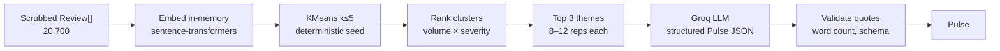

# Phase 3 — Data analysis & summarization strategy

Analysis of the Phase 2 scrubbed corpus (`phase-2-pii-scrub/data/output/scrubbed_reviews.json`) to inform clustering and Groq summarization design.

> Generated from `phase-2-pii-scrub/scripts/analyze_corpus.py` on the current 20k Play / filtered corpus.

---

## 1. Corpus snapshot

| Metric | Value |
|--------|-------|
| **Total reviews** | 20,700 |
| **Play Store** | 20,000 (96.6%) |
| **App Store** | 700 (3.4%) |
| **Avg rating** | 3.14 / 5 |
| **Low (1–2★)** | 8,752 (42.3%) |
| **High (4–5★)** | 10,658 (51.5%) |
| **Avg words / review** | 22.7 (min 6, max 341) |
| **Date range** | 2018-08-02 → 2026-06-08 |

**Implication:** The corpus is **Play-heavy**, **short-text**, and **polarized** (many 1★ and many 5★). A weekly pulse should surface **pain themes** (severity-weighted) while still reflecting volume.

---

## 2. Dominant themes (keyword signals)

Keyword hits on **1–2★ reviews** (proxy for user pain):

| Theme signal | Low-rated hits | % of 1–2★ |
|--------------|----------------|-----------|
| Trading / options / orders | 2,996 | 34.2% |
| Customer support / service | 2,279 | 26.0% |
| Login / crash / technical errors | 1,166 | 13.3% |
| Charges / fees / brokerage | 804 | 9.2% |
| Payments / UPI / failed txn | 768 | 8.8% |
| Withdrawal | 417 | 4.8% |
| KYC / onboarding | 246 | 2.8% |
| Statements / tax | 257 | 2.9% |

**Implication:** Clusters will likely converge on **trading/F&O**, **support responsiveness**, **app stability**, and **fees/charges** — matching the problem-statement examples (KYC, payments, withdrawals) but with **trading** as the largest bucket in this dataset.

---

## 3. Why we cannot skip clustering

| Approach | Token estimate | Verdict |
|----------|----------------|---------|
| Send all 20,700 reviews to Groq | ~610k tokens | **Not feasible** (cost, latency, context limits) |
| Send top 3 themes × 20 reps | ~1,360 words (~1.8k tokens) | **Feasible** |
| Send top 3 themes × 10 reps | ~680 words (~900 tokens) | **Recommended** |

**Conclusion:** Keep [ADR-007](../decisions.md) / [ADR-008](../decisions.md) — **embed + cluster in memory first**, then Groq only on **top-3 cluster summaries + representative reviews**.

---

## 4. Recommended Phase 3 pipeline



### 4.1 Clustering (deterministic)

| Step | Choice | Rationale |
|------|--------|-----------|
| Embeddings | `sentence-transformers/all-MiniLM-L6-v2` (local, free) | Fast on 20k short texts; no API cost |
| Algorithm | KMeans, `k=5`, fixed `random_state` | Reproducible; matches architecture cap |
| Severity score | `% of 1–2★ in cluster` | 42% of corpus is low-rated — weight pain |
| Rank formula | `size × (1 + severity)` | Volume + severity blend per architecture |
| Representatives | 8–12 reviews nearest centroid | ~680 words input; enough for verbatim quotes |

**Optional refinement:** Down-weight reviews older than N months in ranking (corpus spans 2018–2026). Not required for v1 if we treat the export as “current backlog.”

### 4.2 Groq summarization (language only)

| Setting | Value |
|---------|-------|
| Provider | **Groq** (`groq` Python SDK) |
| Model | `llama-3.3-70b-versatile` (default; override via `GROQ_MODEL`) |
| Auth | `GROQ_API_KEY` in `.env` |
| Output | Structured JSON → `Pulse` (Pydantic validation) |
| LLM tasks | Theme labels, one-line summaries, pick 3 quotes from provided reps, 3 action ideas |
| LLM must NOT | Invent quotes, paraphrase quotes, or see full 20k corpus |

**Prompt shape:** One call with:
- Cluster stats (size, avg rating, severity %)
- 8–12 representative review texts per top-3 cluster (with `review.id` for traceability)
- Hard constraints: 3 themes, 3 quotes (verbatim from list), 3 actions, ≤250 words

**Retry:** If quote fidelity fails (substring check) or word count exceeded → repair prompt with explicit failure reason (max 2 retries).

### 4.3 Quote selection strategy

Because reviews are **short** (avg 23 words):
- Prefer **1–3★ reps** within a pain-heavy cluster for quotes (authentic frustration)
- Allow **4–5★ reps** in clusters that skew positive (e.g. “easy SIP onboarding”)
- Groq **selects** from the provided list; code **validates** each quote is a substring of source `Review.text`

---

## 5. Risks from this corpus

| Risk | Mitigation |
|------|------------|
| Play Store dominates (96%) | Include `meta.source_split` in Pulse; don’t over-generalize to iOS |
| `[REDACTED]` tokens in text (PII scrub) | Expected; quotes may contain `[REDACTED]` — still valid verbatim |
| Overlapping themes (trading vs charges vs support) | k=5 + merge small clusters; LLM labels disambiguate |
| Groq rate limits on retry | Single compact prompt; cap reps at 10/theme |
| Historical reviews dilute “weekly” pulse | Future: optional recency filter or `week_of` anchor in config |

---

## 6. Exit criteria alignment

This strategy satisfies [`eval.md`](./eval.md):
- In-memory clustering, no vector DB
- ≤5 themes, top 3 in note
- Groq confined to language work ([ADR-003](../decisions.md))
- Quote fidelity checkable via review IDs
- Input size fits Groq context comfortably (~2k tokens + system prompt)

---

## 7. Re-run analysis

```powershell
cd phase-2-pii-scrub
.venv\Scripts\python scripts\analyze_corpus.py
```
